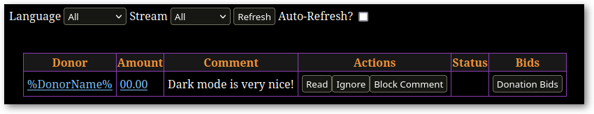
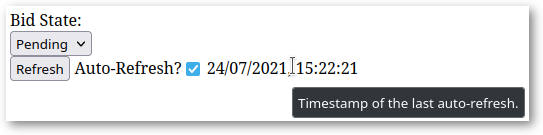

# ESA tweaks
This is a collection of [user scripts](https://en.wikipedia.org/wiki/Userscript)
and [user styles][WikipediaUserStyles] for some pages of the
https://donations.esamarathon.com website.  The source code is distributed under
the terms of the MIT Licence. See [LICENSE.txt](LICENSE.txt) for details.

## User styles

### Dark mode

Dark mode for processing and reading pages with some ESAMarathon trademark
purple and yellow colours.

https://github.com/rybak/esa-tweaks/raw/main/donations-dark-mode.user.css

### Increase space between buttons
Increase spacing between different buttons to make clicking on them
unintentionally less likely.

https://github.com/rybak/esa-tweaks/raw/main/donations-buttons-margins.user.css

### Hide unused UI elements
Hide some UI elements that are not used or are not supposed to be used during
donation screening and donation reading.

https://github.com/rybak/esa-tweaks/raw/main/donations-hide-unused-ui.user.css

### Table tweaks
Minor (personal preference) tweaks for tables on processing and reading pages.

https://github.com/rybak/esa-tweaks/raw/main/donations-table-tweaks.user.css

## User scripts

### Auto-refresh process bids

Adds a "Auto-refresh?" checkbox to the `/process_pending_bids` page, similar to
the existing builtin checkbox on `/process_donations` page.

https://github.com/rybak/esa-tweaks/raw/main/donations-auto-refresh-process-bids.user.js

### Shortcuts
Adds following shortcuts to some pages:

- `R` – refresh the table, same as button "Refresh"
- `A` – flip the state of "Auto-refresh" checkbox

https://github.com/rybak/esa-tweaks/raw/main/donations-shortcuts.user.js

### Reverse events lists
Reverses the lists of events, so that the most recent events are at the top of
the list, which reduces the amount of scrolling needed.

https://github.com/rybak/esa-tweaks/raw/main/donations-reverse-event-lists.user.js

### Process bids layout tweak
Removes linebreaks between UI elements on `/process_pending_bids` page to reduce
the amount of vertical space used.

https://github.com/rybak/esa-tweaks/raw/main/donations-process-bids-tweak.user.js

## How to use ESA tweaks
1. Install browser extensions for user scripts and user styles.
2. Click on the link for the user script or user style in the sections above.
   The corresponding browser extension will automatically recognize the filename
   extension in the link and prompt you for its installation.

# Browser extensions

## For scripts
- Recommended: https://www.tampermonkey.net/
- Big list of different extensions for different browsers available on
  https://greasyfork.org

## For styles
- Recommended – Stylus:
  - [Styles for Chrome/Chromium](https://chrome.google.com/webstore/detail/stylus/clngdbkpkpeebahjckkjfobafhncgmne)
  - [Styles for Firefox](https://addons.mozilla.org/en-US/firefox/addon/styl-us/)

[WikipediaUserStyles]: https://en.wikipedia.org/wiki/Stylus_(browser_extension)
