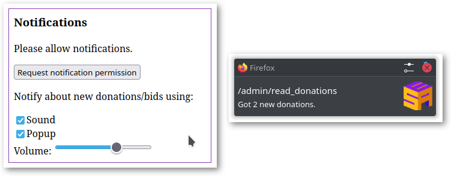

# ESA tweaks
This is a collection of [user scripts](https://en.wikipedia.org/wiki/Userscript)
and [user styles][WikipediaUserStyles] for some pages of the
https://donations.esamarathon.com website.  The source code is distributed under
the terms of the MIT Licence. See [LICENSE.txt](LICENSE.txt) for details.

* [ESA tweaks](#esa-tweaks)
  * [User styles](#user-styles)
    * [Dark mode 🌞→🌚](#dark-mode-)
    * [Increase space between buttons](#increase-space-between-buttons)
    * [Hide unused UI elements](#hide-unused-ui-elements)
    * [Table tweaks](#table-tweaks)
    * [Hide reading buttons](#hide-reading-buttons)
    * [Process bids layout tweak](#process-bids-layout-tweak)
  * [User scripts](#user-scripts)
    * [Auto-refresh process bids](#auto-refresh-process-bids)
    * [Shortcuts](#shortcuts)
    * [New donations notifications](#new-donations-notifications)
    * [Reverse events lists](#reverse-events-lists)
    * [Index paging](#index-paging)
    * [Bids auto-expand](#bids-auto-expand)
  * [How to use ESA tweaks](#how-to-use-esa-tweaks)
* [Browser extensions](#browser-extensions)
  * [For scripts](#for-scripts)
  * [For styles](#for-styles)

## User styles

### Dark mode 🌞→🌚

Dark mode for processing and reading pages with some ESAMarathon trademark
purple and yellow colours.

https://github.com/rybak/esa-tweaks/raw/main/donations-dark-mode.user.css

### Increase space between buttons
Increase spacing between different buttons to make clicking on them
unintentionally less likely.

https://github.com/rybak/esa-tweaks/raw/main/donations-buttons-margins.user.css

### Hide unused UI elements
Hide some UI elements that are not used or are not supposed to be used during
donation screening and donation reading.

https://github.com/rybak/esa-tweaks/raw/main/donations-hide-unused-ui.user.css

### Table tweaks
Minor (personal preference) tweaks for tables on processing and reading pages.

https://github.com/rybak/esa-tweaks/raw/main/donations-table-tweaks.user.css

### Hide reading buttons
As a precaution for donation screeners, hides buttons which should only be used
by donation readers from the `/read_donations` page. Not useful for donation
readers. 😉

https://github.com/rybak/esa-tweaks/raw/main/donations-hide-reading-buttons.user.css

### Process bids layout tweak
Removes linebreaks between UI elements on `/process_pending_bids` page to reduce
the amount of vertical space used.

https://github.com/rybak/esa-tweaks/raw/main/donations-process-bids-tweak.user.css

## User scripts

### Auto-refresh process bids

Adds a "Auto-refresh?" checkbox to the `/process_pending_bids` page, similar to
the existing builtin checkbox on `/process_donations` page.

https://github.com/rybak/esa-tweaks/raw/main/donations-auto-refresh-process-bids.user.js

### Shortcuts
Adds following shortcuts to some pages:

- `R` – refresh the table, same as button "Refresh"
- `A` – toggle "Auto-refresh" checkbox

https://github.com/rybak/esa-tweaks/raw/main/donations-shortcuts.user.js

### New donations notifications

If auto-refresh is enabled, notifies the reader or screener about new donations.
Remember to allow sound to be played and notifications to be shown in the website
settings in your browser. The script keeps track of its settings for each subpage
individually.

https://github.com/rybak/esa-tweaks/raw/main/donations-notifications.user.js

### Reverse events lists
Reverses the lists of events, so that the most recent events are at the top of
the list, which reduces the amount of scrolling needed.

https://github.com/rybak/esa-tweaks/raw/main/donations-reverse-event-lists.user.js

### Index paging

Adds paging links to indexes to make switching to another page easier.

https://github.com/rybak/esa-tweaks/raw/main/donations-index-paging.user.js

### Bids auto-expand

Automatically expands the bids on the page `/read_donations`. Saves clicking
through every bid. Beware of layout of the table changing due to bids having
different height and length.

https://github.com/rybak/esa-tweaks/raw/main/donations-read-auto-load-bids.user.js

## How to use ESA tweaks
1. Install browser extensions for user scripts and user styles.
2. Click on the link for the user script or user style in the sections above.
   The corresponding browser extension will automatically recognize the filename
   extension in the link and prompt you for its installation.
3. After installation, you can use the browser extension popup to disable or
   enable individual scripts and styles if needed.  For some scripts, you will
   need to refresh the page (in browser) to remove effects of the script.

# Browser extensions

## For scripts
- Recommended: https://www.tampermonkey.net/
- Big list of different extensions for different browsers available on
  https://greasyfork.org

## For styles
- Recommended – Stylus:
  - [Styles for Chrome/Chromium](https://chrome.google.com/webstore/detail/stylus/clngdbkpkpeebahjckkjfobafhncgmne)
  - [Styles for Firefox](https://addons.mozilla.org/en-US/firefox/addon/styl-us/)

[WikipediaUserStyles]: https://en.wikipedia.org/wiki/Stylus_(browser_extension)
